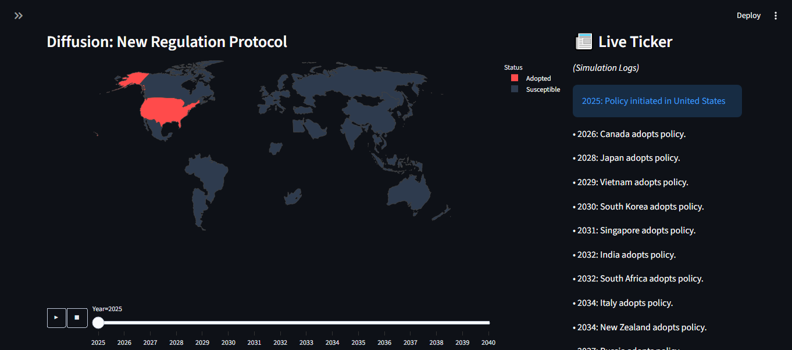

# 🌍 Global AI Policy Diffusion Map


## 📖 Abstract & Concept

**How do laws spread like viruses?**

In the race to regulate Artificial Intelligence, policies rarely exist in isolation. This project addresses a key question in **GovTech & International Relations**: *How does a regulatory framework (like the EU AI Act) leverage geopolitical 'contact networks' to spread to other nations?*

This repository houses an interactive **Policy Diffusion Simulator**. By treating laws as "contagions" and countries as "nodes," it uses the **SIR (Susceptible-Infected-Recovered) Model** to predict global adoption timelines based on diplomatic pressure and trade proximity.

---

## 📸 Visual Demo

> *The dashboard simulating the spread of an "AI Watermarking Act" starting from the United States.*



*(Note: Ensure you have an image named `screenshot.png` in your repository folder)*

---

## ⚡ Key Features

* **🦠 Viral Simulation Engine:** Uses stochastic network theory to model policy adoption probabilities.
* **🕸️ Weighted Geopolitics:** Simulates realistic influence (e.g., EU nations influence each other faster than they influence isolated nations).
* **📊 Temporal Analysis:** A live timeline tracks adoption velocity year-over-year.
* **📰 Dynamic News Feed:** Generates a real-time "news ticker" of countries ratifying the simulated treaty.

---

## 🛠️ Installation & Usage

### 1. Clone the Repository
```bash
git clone [https://github.com/yourusername/policy_diffusion_map.git](https://github.com/yourusername/policy_diffusion_map.git)
cd policy_diffusion_map
```
### 2. Install Dependencies
```bash
pip install -r requirements.txt
```
### 3. Run the Dashboard
```bash
python -m streamlit run policy_map.py
```

## 🧠 The Math Behind It
The core logic relies on a modified SIR Model on a graph $G(V, E)$:
* **Nodes ($V$)**: Countries with attributes (Region, Resistance Score).
* **Edges ($E$)**: Trade/Political connections weighted by strength ($w$).

**Transmission Probability ($P$):**
$$ P(adoption) = (\alpha \times N_{infected}) + (\beta \times P_{pressure}) - R_{resistance} $$

Where:
* $N_{infected}$ = Number of adopting neighbors.
* $P_{pressure}$ = Global viral strength setting.
* $R_{resistance}$ = Intrinsic country resistance factor.

## 📂 Project Structure
```plaintext
📁 policy_diffusion_map
│
├── 📄 policy_map.py       # Main Application Logic (Streamlit)
├── 📄 requirements.txt    # Python Dependencies
├── 📄 README.md           # Documentation
└── 🖼️ screenshot.png      # Demo Image
```

Built by [Kshirja Mehra] | 2026
